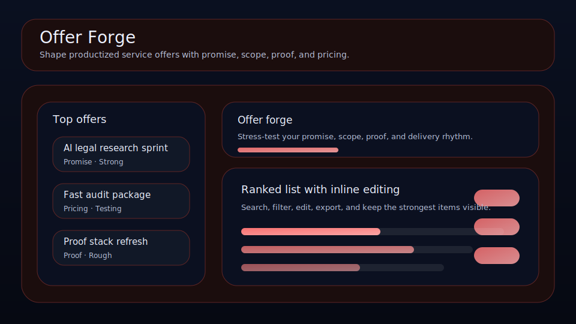

# Offer Forge

Shape productized service offers with promise, scope, proof, and pricing.



Offer Forge is a local-first workspace for founders, operators, and solo builders who want a cleaner way to manage offer blocks. It keeps buyer fit, audience, proof asset, and review timing visible so the right things move forward with less drift.

## What it does

- ranks offer blocks by leverage, buyer fit, timing, and friction
- tracks **audience**, **proof asset**, **next review**, and **buyer fit** for each offer block
- highlights the best current bet, the next review slot, and the strongest signal on the board
- renders a dedicated queue plus a category mix snapshot beneath the main board
- saves locally in the browser with JSON import/export backups
- quick action: **Ready for send**
- quick action: **Raise buyer fit**
- quick action: **Copy offer note**

## Why it feels different

Offer Forge is not just a generic list. It is shaped around the real workflow behind offer blocks, so the board helps you decide what matters next instead of simply storing records.

## Quick start

```bash
git clone https://github.com/get2salam/offer-forge.git
cd offer-forge
python -m http.server 8000
```

Then open <http://localhost:8000>.

## Keyboard shortcuts

- `N` creates a new offer block
- `/` focuses the search box

## Privacy

Everything stays in your browser unless you export a JSON backup.

## License

MIT
